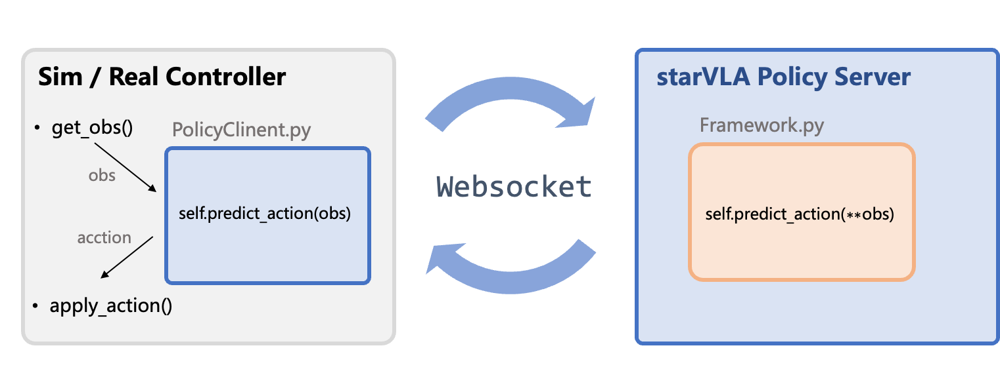

# Training StarVLA with Franka Data

## Part 1: Convert Data to LeRobot 2.1 Format

1. Convert your Franka data into `LeRobot 2.1` format. See `examples/Franka/franka2lerobot/README.md`.

## Part 2: Register Training Data in StarVLA
### 1. Configure the Modality File
Create `modality.json` under your data directory:

```
your_data/meta/modality.json
```

### 2. Register the Dataset

Register your dataset in StarVLA's `dataloader`:

```
starVLA/dataloader/gr00t_lerobot/data_config.py
```

### 3. Configure Data Paths

Create or modify a training configuration file, for example:

```
examples/Franka/train_files/starvla_cotrain_franka_single.yaml
```

Example configuration:

```yaml
vla_data:
  dataset_py: lerobot_datasets
  data_root_dir: playground/Datasets/franka_pick_and_place_lerobot
  data_mix: franka_eef_joints
```

Configure the mixture in `starVLA/dataloader/gr00t_lerobot/mixtures.py` and add the new dataset mixture.

### 4. Validate the DataLoader

Use the following command to check whether the DataLoader works correctly:

```bash
python starVLA/dataloader/lerobot_datasets.py \
    --config_yaml examples/Franka/train_files/starvla_cotrain_franka_single.yaml
```

## Part 3: Model Training Preparation

### 1. Configure Model Parameters

Set model parameters in the YAML configuration file, for example:

```yaml
action_model:
  action_dim: 7
  state_dim: 18
```

### 2. Validate the Model Forward Pass

Before starting training, you can verify that the model forward pass works correctly:

```bash
python starVLA/model/framework/QwenOFT.py \
    --config_yaml examples/Franka/train_files/starvla_cotrain_franka_single.yaml
```

### 3. Start Training

Example training script:

```bash
bash path/to/your/train_script.sh
```

After training, you can find the results and model checkpoints in the configured output directory.


# Deploying StarVLA on a Franka Robot

This section explains how to use the StarVLA policy server to control a robot arm, including how to adapt it to your own robot.

Complete example code:
- **Single-arm** (7D): `eval_files/inference_single_example.py`
- **Dual-arm** (14D): `eval_files/inference_dual_example.py`

## Overall Architecture



**Core workflow:**
1. The client reads multi-view camera images (`np.ndarray`, `uint8`, `(H, W, 3)`).
2. The client sends images and a language instruction to the server over WebSocket.
3. The server returns normalized actions `normalized_actions` with shape `[B, T, action_dim]` (`action_dim=7` for single-arm, `action_dim=14` for dual-arm).
4. The client unnormalizes the actions into real control commands.
5. The client calls `env.step(action)` to execute pose and gripper control together.

## 1. Start the Policy Server

```bash
# Run from the `starVLA_franka` root directory
bash examples/Franka/eval_files/run_policy_server.sh
```

Core contents of `run_policy_server.sh`:
```bash
export PYTHONPATH=$(pwd):${PYTHONPATH}
CUDA_VISIBLE_DEVICES=0 python deployment/model_server/server_policy.py \
    --ckpt_path your_checkpoint.pt \
    --port 5694 \
    --use_bf16
```

After startup, the server listens for WebSocket connections on the specified port and waits for inference requests from clients.

## 2. Client-side Inference

You can either run `eval_files/inference_single_example.py` directly or integrate the workflow into your own system using the following steps:

### 2.1 Connect to the Server

```python
from websocketclient import WebsocketClientPolicy

client = WebsocketClientPolicy(host="127.0.0.1", port=5694)
```

`WebsocketClientPolicy` uses `msgpack_numpy` serialization, which supports direct transmission of NumPy arrays. After connecting, you can call `predict_action()`.

### 2.2 Capture Images

Capture multi-view images from your cameras with the following format:
- **Type**: `np.ndarray`
- **Shape**: `(H, W, 3)`, preferably `(224, 224, 3)`
- **Data type**: `uint8`, RGB format
- **Count**: consistent with the camera views used during training (for example, one wrist camera + one base camera = 2 images)

```python
# Pseudocode: implement this based on your camera SDK
images = [camera_wrist.capture(), camera_base.capture()]  # List[np.ndarray]
```

### 2.3 Build the Request and Call the Server

```python
request_data = {
    "examples": [{
        "image": images,           # List[np.ndarray], multi-view images
        "lang": "Pick up the red cup and place it on the plate.",
    }]
}

result = client.predict_action(request_data)
```

### 2.4 Parse the Response and Unnormalize Actions

```python
# Server response format
# result = {"data": {"normalized_actions": np.ndarray}, "status": "ok"}
# normalized_actions shape: [B, T, action_dim], where B=1, T=prediction horizon, action_dim=7

normalized_actions = result["data"]["normalized_actions"][0]  # [T, 7]

# Unnormalize: [-1, 1] -> real action space
# Formula: action = 0.5 * (normalized + 1) * (max - min) + min
# The gripper dimension is binarized first: < 0.5 -> -1 (close), >= 0.5 -> 1 (open)
actions = unnormalize_actions(normalized_actions, action_norm_stats)
```

### 2.5 Execute Actions

The model outputs an **action chunk** (a T-step action sequence), which should be executed step by step:

```python
for action in actions:
    # action: [x, y, z, roll, pitch, yaw, gripper]
    # env.step() internally handles both pose and gripper control
    obs, reward, done, truncated, info = env.step(action)
    if done or truncated:
        break
```

## 3. Action Space

> ⚠️ **The current implementation is based on Franka robots.** Other robots may use different action dimensions and semantics, such as joint-space control with `N+1` dimensions. Adjust `action_dim`, gripper indices, and unnormalization logic for your robot.

### Single-arm (7D)

For a single-arm Franka setup, the model outputs a **7D action vector**, where pose and gripper are combined in a single vector:
```
action = [x, y, z, roll, pitch, yaw, gripper]

• action[0:3] - position delta (x, y, z), Cartesian coordinates, in meters
• action[3:6] - orientation delta (roll, pitch, yaw), Euler angles, in radians
• action[6]   - gripper control (-1: close, 1: open)
```

### Dual-arm (14D)

For a dual-arm Franka setup, the model outputs a **14D action vector**, i.e. 7D for the left arm and 7D for the right arm:
```
action = [x_l, y_l, z_l, roll_l, pitch_l, yaw_l, gripper_l,
          x_r, y_r, z_r, roll_r, pitch_r, yaw_r, gripper_r]

• action[0:6]   - left-arm pose delta (x, y, z, roll, pitch, yaw)
• action[6]     - left gripper control (-1: close, 1: open)
• action[7:13]  - right-arm pose delta (x, y, z, roll, pitch, yaw)
• action[13]    - right gripper control (-1: close, 1: open)
```

The gripper is part of the action vector and is executed together inside `env.step(action)`, so it does not need to be handled separately.

## 4. Action Unnormalization

The model outputs normalized actions in the range `[-1, 1]`, which must be unnormalized using the statistics computed during training.

### `dataset_statistics.json` Format

**Single-arm (7D):**
```json
{
    "franka": {
        "action": {
            "min": [x_min, y_min, z_min, roll_min, pitch_min, yaw_min, gripper_min],
            "max": [x_max, y_max, z_max, roll_max, pitch_max, yaw_max, gripper_max],
            "mask": [true, true, true, true, true, true, true]
        }
    }
}
```

**Dual-arm (14D):**
```json
{
    "new_embodiment": {
        "action": {
            "min": [7 min values for the left arm..., 7 min values for the right arm...],
            "max": [7 max values for the left arm..., 7 max values for the right arm...],
            "mask": [true, true, ..., true]
        }
    }
}
```

### Unnormalization Formula

```python
# 1. clip to [-1, 1]
normalized = np.clip(normalized, -1, 1)

# 2. binarize gripper actions
if action_dim == 14:  # dual-arm
    normalized[:, 6] = np.where(normalized[:, 6] < 0.5, -1, 1)   # left gripper
    normalized[:, 13] = np.where(normalized[:, 13] < 0.5, -1, 1)  # right gripper
else:  # single-arm
    normalized[:, 6] = np.where(normalized[:, 6] < 0.5, -1, 1)

# 3. map linearly to the real range (only for mask=True dimensions)
action = 0.5 * (normalized + 1) * (max - min) + min
```

## 5. Adapting to a New Robot

If you want to use the StarVLA policy server with a new robot arm, you need to implement the following interfaces:

> ⚠️ The explanation below uses the Franka 7D action space as an example. Your robot may use a different action space, such as joint-space control or a dual-arm setup. In that case, set the correct `action_dim` in the training config and adjust the gripper indices in the unnormalization logic.

### What You Need to Implement

| Component             | Description                                                                 |
|-----------------------|-----------------------------------------------------------------------------|
| **Image acquisition** | Read images from your cameras and output `List[np.ndarray]` in `(H, W, 3)`, `uint8`, RGB format. The number of views must match training. |
| **`env.step(action)`** | Accept an action vector (for Franka: 7D `[x,y,z,roll,pitch,yaw,gripper]`) and handle both pose commands and gripper control internally. Adapt this to your robot's action space. |
| **`env.reset()`** | Reset the robot to its initial pose and return the initial observation. |
| **Normalization statistics** | Provide a matching `dataset_statistics.json` for your robot, generated during training, with dimensions consistent with `action_dim`. |

### What You Do Not Need to Change

| Component             | Description                                                                 |
|-----------------------|-----------------------------------------------------------------------------|
| **Policy Server** | Reuse it directly; just start it with `run_policy_server.sh`. |
| **WebSocket communication** | Reuse `WebsocketClientPolicy` directly. |
| **Unnormalization logic** | Reuse `unnormalize_actions()` directly, as long as you provide the matching statistics file. |
| **Request/response format** | Unchanged: send `{image, lang}` and receive `{normalized_actions}`. |

### `env.step()` Reference Implementation - Single-arm

```python
def step(self, action: np.ndarray):
    """
    Execute a 7D action: [x, y, z, roll, pitch, yaw, gripper]
    Pose and gripper are handled in the same function.
    """
    pose_delta = action[0:6]    # pose delta
    gripper_cmd = action[6]     # gripper: -1=close, 1=open

    # 1. Pose control
    target_pose = self.current_pose + pose_delta * self.action_scale
    target_pose = np.clip(target_pose, self.pose_limit_low, self.pose_limit_high)
    self.robot.move_to(target_pose)

    # 2. Gripper control
    if gripper_cmd >= 0.9:
        self.robot.open_gripper()
    elif gripper_cmd <= -0.9:
        self.robot.close_gripper()

    # 3. Read the observation
    obs = self.get_obs()
    reward = self.compute_reward()
    done = self.check_done()
    return obs, reward, done, False, {}
```

### `env.step()` Reference Implementation - Dual-arm

```python
def step(self, action: np.ndarray):
    """
    Execute a 14D action: [left-arm 7D, right-arm 7D]
    Dual-arm pose and gripper control are handled in the same function.
    """
    # Left arm
    left_pose_delta = action[0:6]
    left_gripper_cmd = action[6]
    # Right arm
    right_pose_delta = action[7:13]
    right_gripper_cmd = action[13]

    # 1. Left-arm pose control
    left_target = self.left_current_pose + left_pose_delta * self.action_scale
    left_target = np.clip(left_target, self.left_pose_limit_low, self.left_pose_limit_high)
    self.left_robot.move_to(left_target)

    # 2. Left gripper control
    if left_gripper_cmd >= 0.9:
        self.left_robot.open_gripper()
    elif left_gripper_cmd <= -0.9:
        self.left_robot.close_gripper()

    # 3. Right-arm pose control
    right_target = self.right_current_pose + right_pose_delta * self.action_scale
    right_target = np.clip(right_target, self.right_pose_limit_low, self.right_pose_limit_high)
    self.right_robot.move_to(right_target)

    # 4. Right gripper control
    if right_gripper_cmd >= 0.9:
        self.right_robot.open_gripper()
    elif right_gripper_cmd <= -0.9:
        self.right_robot.close_gripper()

    # 5. Read the observation
    obs = self.get_obs()
    reward = self.compute_reward()
    done = self.check_done()
    return obs, reward, done, False, {}
```
